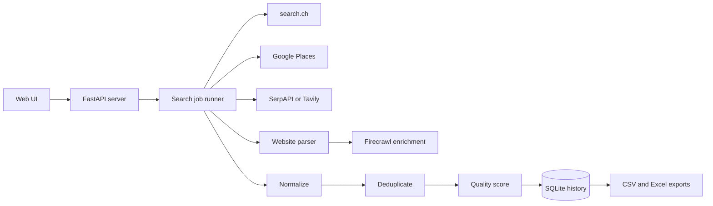
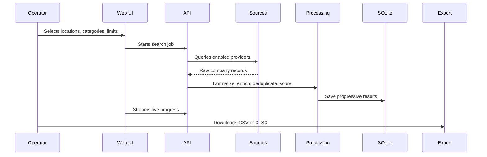

<div align="center">

# Swiss B2B Leads

**A FastAPI-powered Swiss lead intelligence workspace for finding, enriching, scoring, deduplicating, and exporting B2B company leads.**

[](LICENSE)


</div>

---

## Overview

Swiss B2B Leads is a focused lead-generation tool for Swiss company discovery. It combines public Swiss directory data, optional search APIs, website parsing, enrichment, deduplication, quality scoring, and export workflows into a single local web app.

The application is useful when you need a repeatable pipeline for building clean prospect lists by city, canton, industry, and contact quality.

## What It Does

- Searches Swiss business sources by location and category.
- Uses search.ch without requiring an API key.
- Optionally enriches results with Google Places, SerpAPI, Tavily, and Firecrawl.
- Parses company websites for emails, phones, contact pages, and metadata.
- Deduplicates leads by domain, email, phone, and name/location signals.
- Scores lead quality from 0 to 100.
- Saves progressive search history in SQLite.
- Supports pause, resume, restart, and export workflows.
- Exports clean datasets to CSV and XLSX.

## Architecture



## Data Pipeline



## Source Matrix

| Source | Key | Role |
| --- | --- | --- |
| search.ch | Not required | Swiss directory discovery |
| Google Places | `GOOGLE_API_KEY` | Structured business data |
| SerpAPI | `SERP_API_KEY` | Search result discovery |
| Tavily | `TAVILY_API_KEY` | Search result discovery |
| Website parser | Not required | Contact extraction from company sites |
| Firecrawl | `FIRECRAWL_API_KEY` | Optional advanced website extraction |

## Repository Layout

```text
.
|-- swiss_b2b_leads/
|   |-- app_server.py        # FastAPI web application
|   |-- runner.py            # Search orchestration
|   |-- db.py                # SQLite persistence
|   |-- config.py            # Runtime configuration
|   |-- sources/             # Provider integrations
|   |-- processing/          # Normalize, dedupe, score, summarize
|   |-- exporters/           # CSV and XLSX exporters
|   |-- static/              # Web UI assets
|   |-- tests/               # Unit tests
|   `-- .env.example         # Local configuration template
|-- LICENSE
`-- README.md
```

## Quick Start

```powershell
cd swiss_b2b_leads
python -m venv .venv
.\.venv\Scripts\Activate.ps1
pip install -r requirements.txt
copy .env.example .env
python app_server.py
```

Open `http://localhost:8000`.

## Configuration

Local configuration lives in `swiss_b2b_leads/.env`. Real `.env` files are ignored.

```env
GOOGLE_API_KEY=
SERP_API_KEY=
TAVILY_API_KEY=
FIRECRAWL_API_KEY=
SEARCH_CH_API_KEY=
OUTPUT_DIR=output
MAX_RESULTS_PER_QUERY=50
```

Only `search.ch` and the built-in website parser can run without third-party API keys. Other providers are enabled automatically when their keys are present.

## Tests

```powershell
cd swiss_b2b_leads
python -m pytest tests/ -v
```

## Security Notes

- Do not commit real `.env` files or API keys.
- Output files, local databases, logs, and virtual environments are ignored.
- Rotate any API credentials that were ever committed before this cleanup.
- Keep provider keys scoped and quota-limited when possible.

## License

This project is released under the [MIT License](LICENSE).
